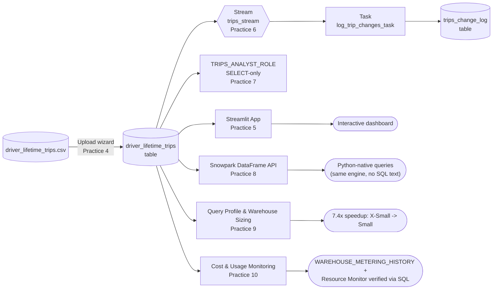
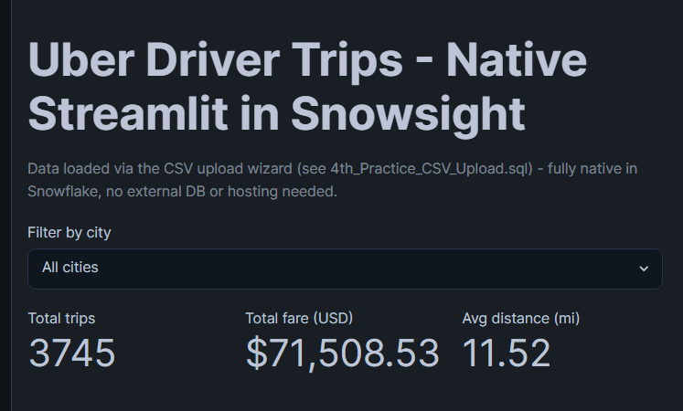
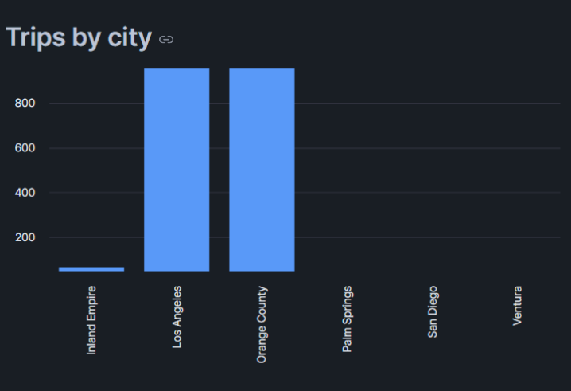
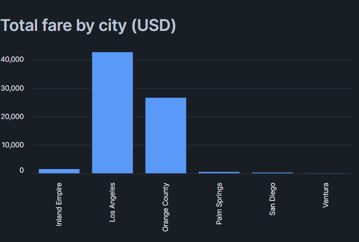
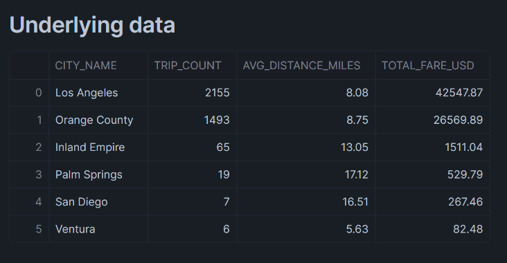
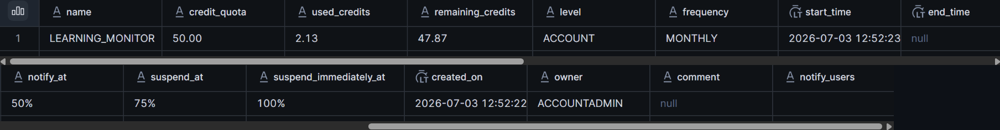
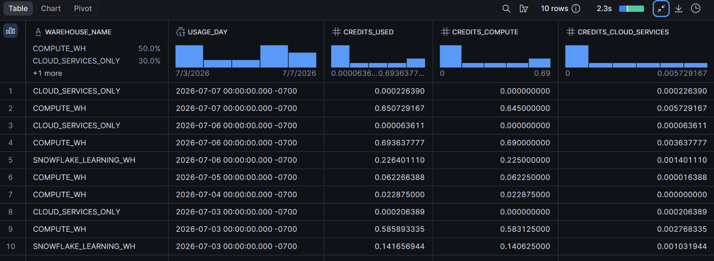
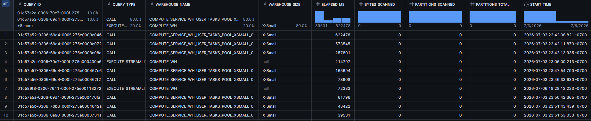

# Snowflake A-Z

Hands-on Snowflake practice covering SQL fundamentals, data ingestion, disaster-recovery mechanics, automation, access control, the Python DataFrame API (Snowpark), query performance tuning, and cost/usage monitoring - built during a 30-day Snowflake trial.

## Why this repo has no live demo

This was a deliberate 30-day / $400-credit Snowflake trial used purely to learn the platform - not a production account kept running indefinitely. Every script here was executed for real against a live Snowflake account and verified before being committed. Once the trial period ends the account is not renewed, so there is no persistent hosted dashboard to link to - the code and the verified results (including the screenshots below) captured along the way are the proof of work.

## What's covered

<!-- PRACTICES_TABLE:START -->
| # | File | Topic | Verified result |
|---|------|-------|------------------|
| 1 | [`1st_Practice.sql`](1st_Practice.sql) | SQL basics: filter, join, aggregate, CTE, window functions | 7 queries against TPCH_SF1 sample data (customer/orders/nation) |
| 2 | [`2nd_Practice_S3_Ingestion.sql`](2nd_Practice_S3_Ingestion.sql) | External stage + `COPY INTO` from S3, semi-structured data (`VARIANT`, `LATERAL FLATTEN`) | 100 rows loaded from a public S3 bucket, 0 errors |
| 3 | [`3rd_Practice_TimeTravel_Clone.sql`](3rd_Practice_TimeTravel_Clone.sql) | Time Travel, DROP + UNDROP, zero-copy clone | Restored deleted rows via `AT(OFFSET)`, undropped a table, proved clone independence (90 vs 100 rows) |
| 4 | [`4th_Practice_CSV_Upload.sql`](4th_Practice_CSV_Upload.sql) | Local CSV upload wizard (UI path, not `COPY INTO`) | 3,745 real rows loaded from a personal Uber-trips dataset |
| 5 | [`5th_Practice_Streamlit_Capstone.py`](5th_Practice_Streamlit_Capstone.py) | Native Streamlit-in-Snowflake app build/deploy process | Interactive dashboard built and deployed (see below) |
| 6 | [`6th_Practice_Streams_Tasks.sql`](6th_Practice_Streams_Tasks.sql) | Streams (CDC) + Tasks (scheduled/triggered automation) | Stream captured 2 inserted rows, a task moved them into a change log, stream drained to 0 |
| 7 | [`7th_Practice_RBAC.sql`](7th_Practice_RBAC.sql) | Role-based access control, least privilege | Custom read-only role: `SELECT` succeeded, `INSERT` correctly rejected |
| 8 | [`8th_Practice_Snowpark.py`](8th_Practice_Snowpark.py) | Snowpark: Python DataFrame API (filter/group_by/agg, window functions, lazy query plans) | Same rollup + top-3-per-city ranking as practice 1, expressed as chained DataFrame calls instead of SQL text; `.queries` used to confirm the generated SQL is pushed down, not computed client-side |
| 9 | [`9th_Practice_QueryProfile_Performance.sql`](9th_Practice_QueryProfile_Performance.sql) | Query Profile (operator tree, bytes/partitions scanned), warehouse sizing, partition pruning | X-Small -> Small on the same 14M-row `CROSS JOIN`: 864ms -> 117ms (~7.4x); confirmed a ~3.7k-row table lives in a single micro-partition, so no `WHERE` clause can reduce partitions scanned |
| 10 | [`10th_Practice_Cost_Monitoring.sql`](10th_Practice_Cost_Monitoring.sql) | Cost & usage monitoring: `WAREHOUSE_METERING_HISTORY`, resource monitors via `SHOW` + `RESULT_SCAN`, `ACCOUNT_USAGE.QUERY_HISTORY` | Verified the Day-1 `LEARNING_MONITOR` guardrails (50 credit quota, notify/suspend at 50%/75%/100%) are still active at 2.13 of 50 credits used |
<!-- PRACTICES_TABLE:END -->

The table above is generated from [`practices.json`](practices.json) by [`scripts/generate_readme_table.py`](scripts/generate_readme_table.py), auto-run by a GitHub Action on every push that touches `practices.json` - add a new practice by editing the JSON, not the markdown.

The Streamlit dashboard's actual application code lives in [`streamlit_app/streamlit_app.py`](streamlit_app/streamlit_app.py).

## Architecture

## Dashboard

Built on `driver_lifetime_trips` (3,745 rows, loaded in practice 4): a city filter drives three KPI metrics and two bar charts, backed entirely by `st.connection("snowflake").session().sql(...)` - no external database, no separate auth.

  

- **All cities:** 3,745 trips · $71,508.53 total fare · 11.52 mi avg distance
- **Filtered to Los Angeles:** 2,155 trips · $42,547.87 · 8.08 mi
- **Filtered to Ventura:** 6 trips · $82.48 · 5.63 mi

  
  

  

## Cost & Performance Monitoring (Practices 9-10)

Real numbers pulled with SQL, not just read off the Snowsight screen.

  

The Day-1 `LEARNING_MONITOR` guardrails, read back with `SHOW RESOURCE MONITORS` + `RESULT_SCAN(LAST_QUERY_ID())`: 50-credit quota, notify/suspend/suspend-immediately at 50%/75%/100%, 2.13 of 50 credits used after about a week of practices.

  

Daily credit burn per warehouse from `SNOWFLAKE.ACCOUNT_USAGE.WAREHOUSE_METERING_HISTORY` - the real cost ground truth behind the resource monitor above.

  

Top-10 queries by `total_elapsed_time` from `ACCOUNT_USAGE.QUERY_HISTORY` - and the honest finding from practice 10: the longest-running entries are `CALL`/`EXECUTE_STREAMLIT` sessions with `0` bytes and `0` partitions scanned. They dominate an elapsed-time ranking just by sitting open (idle container/browser tab), not by doing real compute work - elapsed time is a poor proxy for cost; the credits chart above is the real signal.

## Stack

- Snowflake (Standard Edition, AWS us-east-2)
- SQL (Snowflake dialect)
- Python + Snowpark + Streamlit (native Streamlit-in-Snowflake)
- pandas

## Naming convention

Files are numbered in the order they were completed, each following the same lecture format: a header banner explaining the goal, a `SETUP` block restoring session context, lettered `PART` sections with a "Use case" explanation before every query, and a `RECAP` at the end summarizing the takeaways.

---

**CI:**  — SQL parse-check (SQLFluff, Snowflake dialect) + Python syntax check on every push.
 — practices table auto-generated from `practices.json`.
